

  

  
  # 📈 GitTrendHub – The Pulse of Open Source
 
  
  
  
  

 

  <strong>An automated, expansive snapshot of the hottest repositories in AI, Web Dev, and Productivity.</strong> 
  <i>Powered by GitHub Actions, Custom SVG Metrics, and the Open Source Community.</i>

 

> **💡 How it Works:** This dashboard runs automatically every week. It pulls live metrics and generates **custom local SVG cards** to visualize trends with a premium feel.

---

<h2 id="table-of-contents">📑 Table of Contents</h2>

- [🤖 AI & Machine Learning](#ai)
- [🌐 Modern Web Development](#web)
- [⚡️ Productivity & Tools](#productivity)
- [🗄️ Databases & Infrastructure](#databases)
- [📝 Data & Contributions](#-data--contributions)

 

<h2 id='ai'>🤖 AI & Machine Learning</h2>

<table width="100%">
  <tr>
    <td width="60%" style="vertical-align: top;">
      <h3><a href="https://github.com/Significant-Gravitas/AutoGPT">AutoGPT</a></h3>
      
AutoGPT is the vision of accessible AI for everyone, to use and to build on. Our mission is to provide the tools, so ...

      
    </td>
    <td width="40%" style="vertical-align: top; text-align: center;">
      
    </td>
  </tr>
</table>

<a href="#table-of-contents">🔼 Back to Top</a>

<table width="100%">
  <tr>
    <td width="60%" style="vertical-align: top;">
      <h3><a href="https://github.com/ollama/ollama">ollama</a></h3>
      
Get up and running with Kimi-K2.5, GLM-5, MiniMax, DeepSeek, gpt-oss, Qwen, Gemma and other models.

      
    </td>
    <td width="40%" style="vertical-align: top; text-align: center;">
      
    </td>
  </tr>
</table>

<a href="#table-of-contents">🔼 Back to Top</a>

<table width="100%">
  <tr>
    <td width="60%" style="vertical-align: top;">
      <h3><a href="https://github.com/AUTOMATIC1111/stable-diffusion-webui">stable-diffusion-webui</a></h3>
      
Stable Diffusion web UI

      
    </td>
    <td width="40%" style="vertical-align: top; text-align: center;">
      
    </td>
  </tr>
</table>

<a href="#table-of-contents">🔼 Back to Top</a>

<table width="100%">
  <tr>
    <td width="60%" style="vertical-align: top;">
      <h3><a href="https://github.com/huggingface/transformers">transformers</a></h3>
      
🤗 Transformers: the model-definition framework for state-of-the-art machine learning models in text, vision, audio, a...

      
    </td>
    <td width="40%" style="vertical-align: top; text-align: center;">
      
    </td>
  </tr>
</table>

<a href="#table-of-contents">🔼 Back to Top</a>

<table width="100%">
  <tr>
    <td width="60%" style="vertical-align: top;">
      <h3><a href="https://github.com/langchain-ai/langchain">langchain</a></h3>
      
The agent engineering platform

      
    </td>
    <td width="40%" style="vertical-align: top; text-align: center;">
      
    </td>
  </tr>
</table>

<a href="#table-of-contents">🔼 Back to Top</a>

<table width="100%">
  <tr>
    <td width="60%" style="vertical-align: top;">
      <h3><a href="https://github.com/open-webui/open-webui">open-webui</a></h3>
      
User-friendly AI Interface (Supports Ollama, OpenAI API, ...)

      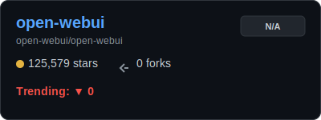
    </td>
    <td width="40%" style="vertical-align: top; text-align: center;">
      
    </td>
  </tr>
</table>

<a href="#table-of-contents">🔼 Back to Top</a>

<table width="100%">
  <tr>
    <td width="60%" style="vertical-align: top;">
      <h3><a href="https://github.com/ggml-org/llama.cpp">llama.cpp</a></h3>
      
LLM inference in C/C++

      
    </td>
    <td width="40%" style="vertical-align: top; text-align: center;">
      
    </td>
  </tr>
</table>

<a href="#table-of-contents">🔼 Back to Top</a>

---

<h2 id='web'>🌐 Modern Web Development</h2>

<table width="100%">
  <tr>
    <td width="60%" style="vertical-align: top;">
      <h3><a href="https://github.com/facebook/react">react</a></h3>
      
The library for web and native user interfaces.

      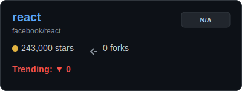
    </td>
    <td width="40%" style="vertical-align: top; text-align: center;">
      
    </td>
  </tr>
</table>

<a href="#table-of-contents">🔼 Back to Top</a>

<table width="100%">
  <tr>
    <td width="60%" style="vertical-align: top;">
      <h3><a href="https://github.com/vercel/next.js">next.js</a></h3>
      
The React Framework

      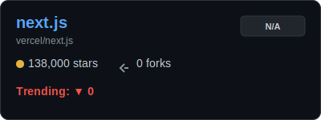
    </td>
    <td width="40%" style="vertical-align: top; text-align: center;">
      
    </td>
  </tr>
</table>

<a href="#table-of-contents">🔼 Back to Top</a>

<table width="100%">
  <tr>
    <td width="60%" style="vertical-align: top;">
      <h3><a href="https://github.com/tailwindlabs/tailwindcss">tailwindcss</a></h3>
      
A utility-first CSS framework for rapid UI development.

      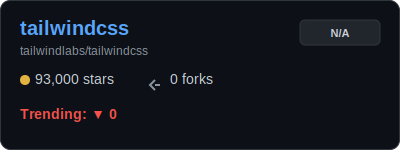
    </td>
    <td width="40%" style="vertical-align: top; text-align: center;">
      
    </td>
  </tr>
</table>

<a href="#table-of-contents">🔼 Back to Top</a>

<table width="100%">
  <tr>
    <td width="60%" style="vertical-align: top;">
      <h3><a href="https://github.com/sveltejs/svelte">svelte</a></h3>
      
web development for the rest of us

      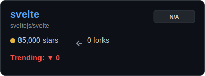
    </td>
    <td width="40%" style="vertical-align: top; text-align: center;">
      
    </td>
  </tr>
</table>

<a href="#table-of-contents">🔼 Back to Top</a>

<table width="100%">
  <tr>
    <td width="60%" style="vertical-align: top;">
      <h3><a href="https://github.com/vitejs/vite">vite</a></h3>
      
Next generation frontend tooling. It's fast!

      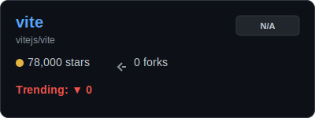
    </td>
    <td width="40%" style="vertical-align: top; text-align: center;">
      
    </td>
  </tr>
</table>

<a href="#table-of-contents">🔼 Back to Top</a>

<table width="100%">
  <tr>
    <td width="60%" style="vertical-align: top;">
      <h3><a href="https://github.com/vuejs/core">core</a></h3>
      
🖖 Vue.js is a progressive, incrementally-adoptable JavaScript framework for building UI on the web.

      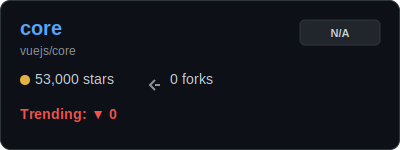
    </td>
    <td width="40%" style="vertical-align: top; text-align: center;">
      
    </td>
  </tr>
</table>

<a href="#table-of-contents">🔼 Back to Top</a>

<table width="100%">
  <tr>
    <td width="60%" style="vertical-align: top;">
      <h3><a href="https://github.com/remix-run/remix">remix</a></h3>
      
Build Better Websites. Create modern, resilient user experiences with web fundamentals.

      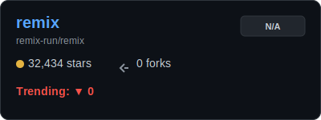
    </td>
    <td width="40%" style="vertical-align: top; text-align: center;">
      
    </td>
  </tr>
</table>

<a href="#table-of-contents">🔼 Back to Top</a>

---

<h2 id='productivity'>⚡️ Productivity & Tools</h2>

<table width="100%">
  <tr>
    <td width="60%" style="vertical-align: top;">
      <h3><a href="https://github.com/ohmyzsh/ohmyzsh">ohmyzsh</a></h3>
      
🙃   A delightful community-driven (with 2,400+ contributors) framework for managing your zsh configuration. Includes ...

      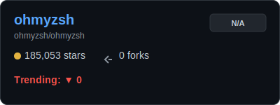
    </td>
    <td width="40%" style="vertical-align: top; text-align: center;">
      
    </td>
  </tr>
</table>

<a href="#table-of-contents">🔼 Back to Top</a>

<table width="100%">
  <tr>
    <td width="60%" style="vertical-align: top;">
      <h3><a href="https://github.com/neovim/neovim">neovim</a></h3>
      
Vim-fork focused on extensibility and usability

      
    </td>
    <td width="40%" style="vertical-align: top; text-align: center;">
      
    </td>
  </tr>
</table>

<a href="#table-of-contents">🔼 Back to Top</a>

<table width="100%">
  <tr>
    <td width="60%" style="vertical-align: top;">
      <h3><a href="https://github.com/jesseduffield/lazygit">lazygit</a></h3>
      
simple terminal UI for git commands

      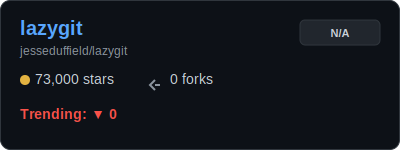
    </td>
    <td width="40%" style="vertical-align: top; text-align: center;">
      
    </td>
  </tr>
</table>

<a href="#table-of-contents">🔼 Back to Top</a>

<table width="100%">
  <tr>
    <td width="60%" style="vertical-align: top;">
      <h3><a href="https://github.com/alacritty/alacritty">alacritty</a></h3>
      
A cross-platform, OpenGL terminal emulator.

      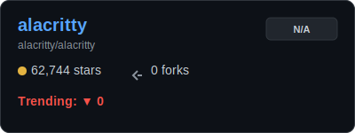
    </td>
    <td width="40%" style="vertical-align: top; text-align: center;">
      
    </td>
  </tr>
</table>

<a href="#table-of-contents">🔼 Back to Top</a>

<table width="100%">
  <tr>
    <td width="60%" style="vertical-align: top;">
      <h3><a href="https://github.com/tmux/tmux">tmux</a></h3>
      
tmux source code

      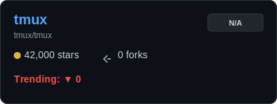
    </td>
    <td width="40%" style="vertical-align: top; text-align: center;">
      
    </td>
  </tr>
</table>

<a href="#table-of-contents">🔼 Back to Top</a>

<table width="100%">
  <tr>
    <td width="60%" style="vertical-align: top;">
      <h3><a href="https://github.com/obsidianmd/obsidian-releases">obsidian-releases</a></h3>
      
Community plugins list, theme list, and releases of Obsidian.

      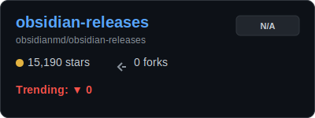
    </td>
    <td width="40%" style="vertical-align: top; text-align: center;">
      
    </td>
  </tr>
</table>

<a href="#table-of-contents">🔼 Back to Top</a>

<table width="100%">
  <tr>
    <td width="60%" style="vertical-align: top;">
      <h3><a href="https://github.com/raycast/script-commands">script-commands</a></h3>
      
Script Commands let you tailor Raycast to your needs. Think of them as little productivity boosts throughout your day.

      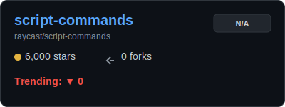
    </td>
    <td width="40%" style="vertical-align: top; text-align: center;">
      
    </td>
  </tr>
</table>

<a href="#table-of-contents">🔼 Back to Top</a>

---

<h2 id='databases'>🗄️ Databases & Infrastructure</h2>

<table width="100%">
  <tr>
    <td width="60%" style="vertical-align: top;">
      <h3><a href="https://github.com/supabase/supabase">supabase</a></h3>
      
The Postgres development platform. Supabase gives you a dedicated Postgres database to build your web, mobile, and AI...

      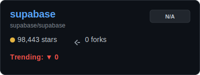
    </td>
    <td width="40%" style="vertical-align: top; text-align: center;">
      
    </td>
  </tr>
</table>

<a href="#table-of-contents">🔼 Back to Top</a>

<table width="100%">
  <tr>
    <td width="60%" style="vertical-align: top;">
      <h3><a href="https://github.com/redis/redis">redis</a></h3>
      
For developers, who are building real-time data-driven applications, Redis is the preferred, fastest, and most featur...

      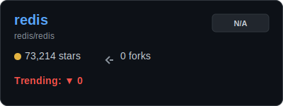
    </td>
    <td width="40%" style="vertical-align: top; text-align: center;">
      
    </td>
  </tr>
</table>

<a href="#table-of-contents">🔼 Back to Top</a>

<table width="100%">
  <tr>
    <td width="60%" style="vertical-align: top;">
      <h3><a href="https://github.com/postgres/postgres">postgres</a></h3>
      
Mirror of the official PostgreSQL GIT repository. Note that this is just a *mirror* - we don't work with pull request...

      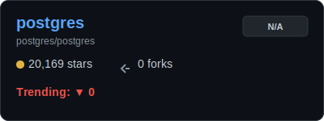
    </td>
    <td width="40%" style="vertical-align: top; text-align: center;">
      
    </td>
  </tr>
</table>

<a href="#table-of-contents">🔼 Back to Top</a>

---

---

## 📝 Data & Contributions

Data is retrieved using the GitHub REST API and GitHub Actions. Historical data charts are seamlessly generated via [Star-History](https://star-history.com/).

### Want your project mapped here?
Contributions are incredibly welcome! To add a new project or category:
1. `Fork` this repository.
2. Add your favorite `OWNER/REPO` to the `projects.json` file.
3. Open a `Pull Request`! Our automated workflow will pick it up on the next run.

  <i>✨ Last Generated: March 03, 2026 - 15:12 UTC</i>

