

  

# 🤖 AI TrendHub – The Pulse of Artificial Intelligence
 

  
  
  

 

> **💡 Specializing in AI:** This dashboard focuses exclusively on the rapidly evolving AI ecosystem, trackging the most impactful projects across engines, agents, and generative tools.

---

## 📑 Table of Contents

- [🤖 LLM Engines & Platforms](#llm_engines)
- [🛠️ AI Agents & Orchestration](#agents)
- [💻 AI-Powered CLI & DevTools](#cli_tools)
- [🎨 Generative Art & Vision](#art_vision)
- [🧠 Research & Core Frameworks](#frameworks)
- [🤝 Join the Community & Contribute](#how-to-contribute)
- [📝 Data Summary](#-data--contributions)

 

<h2 id='llm_engines'>🤖 LLM Engines & Platforms</h2>

<table width="100%">
  <tr>
    <td width="60%" style="vertical-align: top;">
      <h3><a href="https://github.com/ollama/ollama">ollama</a></h3>
      
Get up and running with Kimi-K2.5, GLM-5, MiniMax, DeepSeek, gpt-oss, Qwen, Gemma and other models.

      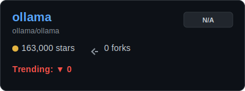
    </td>
    <td width="40%" style="vertical-align: top; text-align: center;">
      
    </td>
  </tr>
</table>

<a href="#table-of-contents">🔼 Back to Top</a>

<table width="100%">
  <tr>
    <td width="60%" style="vertical-align: top;">
      <h3><a href="https://github.com/deepseek-ai/DeepSeek-V3">DeepSeek-V3</a></h3>
      
No description provided

      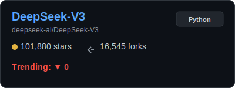
    </td>
    <td width="40%" style="vertical-align: top; text-align: center;">
      
    </td>
  </tr>
</table>

<a href="#table-of-contents">🔼 Back to Top</a>

<table width="100%">
  <tr>
    <td width="60%" style="vertical-align: top;">
      <h3><a href="https://github.com/ggerganov/llama.cpp">llama.cpp</a></h3>
      
LLM inference in C/C++

      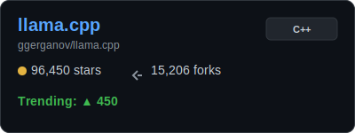
    </td>
    <td width="40%" style="vertical-align: top; text-align: center;">
      
    </td>
  </tr>
</table>

<a href="#table-of-contents">🔼 Back to Top</a>

<table width="100%">
  <tr>
    <td width="60%" style="vertical-align: top;">
      <h3><a href="https://github.com/vllm-project/vllm">vllm</a></h3>
      
A high-throughput and memory-efficient inference and serving engine for LLMs

      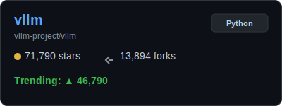
    </td>
    <td width="40%" style="vertical-align: top; text-align: center;">
      
    </td>
  </tr>
</table>

<a href="#table-of-contents">🔼 Back to Top</a>

---

<h2 id='agents'>🛠️ AI Agents & Orchestration</h2>

<table width="100%">
  <tr>
    <td width="60%" style="vertical-align: top;">
      <h3><a href="https://github.com/openclaw/openclaw">openclaw</a></h3>
      
Your own personal AI assistant. Any OS. Any Platform. The lobster way. 🦞 

      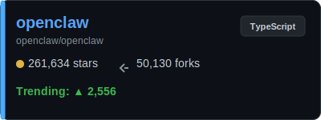
    </td>
    <td width="40%" style="vertical-align: top; text-align: center;">
      
    </td>
  </tr>
</table>

<a href="#table-of-contents">🔼 Back to Top</a>

<table width="100%">
  <tr>
    <td width="60%" style="vertical-align: top;">
      <h3><a href="https://github.com/Significant-Gravitas/AutoGPT">AutoGPT</a></h3>
      
AutoGPT is the vision of accessible AI for everyone, to use and to build on. Our mission is to provide the tools, so ...

      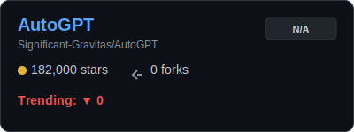
    </td>
    <td width="40%" style="vertical-align: top; text-align: center;">
      
    </td>
  </tr>
</table>

<a href="#table-of-contents">🔼 Back to Top</a>

<table width="100%">
  <tr>
    <td width="60%" style="vertical-align: top;">
      <h3><a href="https://github.com/browser-use/browser-use">browser-use</a></h3>
      
🌐 Make websites accessible for AI agents. Automate tasks online with ease.

      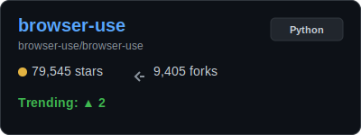
    </td>
    <td width="40%" style="vertical-align: top; text-align: center;">
      
    </td>
  </tr>
</table>

<a href="#table-of-contents">🔼 Back to Top</a>

<table width="100%">
  <tr>
    <td width="60%" style="vertical-align: top;">
      <h3><a href="https://github.com/joaomdmoura/crewAI">crewAI</a></h3>
      
Framework for orchestrating role-playing, autonomous AI agents. By fostering collaborative intelligence, CrewAI empow...

      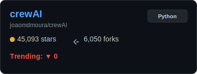
    </td>
    <td width="40%" style="vertical-align: top; text-align: center;">
      
    </td>
  </tr>
</table>

<a href="#table-of-contents">🔼 Back to Top</a>

---

<h2 id='cli_tools'>💻 AI-Powered CLI & DevTools</h2>

<table width="100%">
  <tr>
    <td width="60%" style="vertical-align: top;">
      <h3><a href="https://github.com/anthropics/claude-code">claude-code</a></h3>
      
Claude Code is an agentic coding tool that lives in your terminal, understands your codebase, and helps you code fast...

      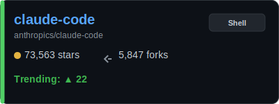
    </td>
    <td width="40%" style="vertical-align: top; text-align: center;">
      
    </td>
  </tr>
</table>

<a href="#table-of-contents">🔼 Back to Top</a>

<table width="100%">
  <tr>
    <td width="60%" style="vertical-align: top;">
      <h3><a href="https://github.com/OpenInterpreter/open-interpreter">open-interpreter</a></h3>
      
A natural language interface for computers

      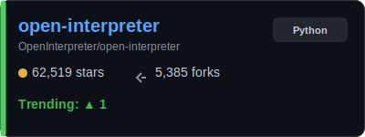
    </td>
    <td width="40%" style="vertical-align: top; text-align: center;">
      
    </td>
  </tr>
</table>

<a href="#table-of-contents">🔼 Back to Top</a>

<table width="100%">
  <tr>
    <td width="60%" style="vertical-align: top;">
      <h3><a href="https://github.com/paul-gauthier/aider">aider</a></h3>
      
aider is AI pair programming in your terminal

      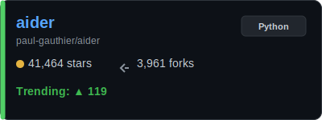
    </td>
    <td width="40%" style="vertical-align: top; text-align: center;">
      
    </td>
  </tr>
</table>

<a href="#table-of-contents">🔼 Back to Top</a>

---

<h2 id='art_vision'>🎨 Generative Art & Vision</h2>

<table width="100%">
  <tr>
    <td width="60%" style="vertical-align: top;">
      <h3><a href="https://github.com/AUTOMATIC1111/stable-diffusion-webui">stable-diffusion-webui</a></h3>
      
Stable Diffusion web UI

      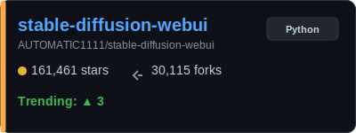
    </td>
    <td width="40%" style="vertical-align: top; text-align: center;">
      
    </td>
  </tr>
</table>

<a href="#table-of-contents">🔼 Back to Top</a>

<table width="100%">
  <tr>
    <td width="60%" style="vertical-align: top;">
      <h3><a href="https://github.com/comfyanonymous/ComfyUI">ComfyUI</a></h3>
      
The most powerful and modular diffusion model GUI, api and backend with a graph/nodes interface.

      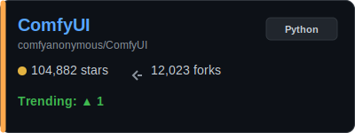
    </td>
    <td width="40%" style="vertical-align: top; text-align: center;">
      
    </td>
  </tr>
</table>

<a href="#table-of-contents">🔼 Back to Top</a>

<table width="100%">
  <tr>
    <td width="60%" style="vertical-align: top;">
      <h3><a href="https://github.com/black-forest-labs/flux">flux</a></h3>
      
Official inference repo for FLUX.1 models

      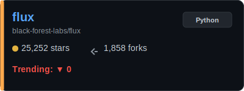
    </td>
    <td width="40%" style="vertical-align: top; text-align: center;">
      
    </td>
  </tr>
</table>

<a href="#table-of-contents">🔼 Back to Top</a>

---

<h2 id='frameworks'>🧠 Research & Core Frameworks</h2>

<table width="100%">
  <tr>
    <td width="60%" style="vertical-align: top;">
      <h3><a href="https://github.com/huggingface/transformers">transformers</a></h3>
      
🤗 Transformers: the model-definition framework for state-of-the-art machine learning models in text, vision, audio, a...

      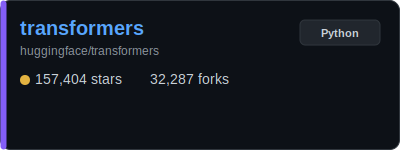
    </td>
    <td width="40%" style="vertical-align: top; text-align: center;">
      
    </td>
  </tr>
</table>

<a href="#table-of-contents">🔼 Back to Top</a>

<table width="100%">
  <tr>
    <td width="60%" style="vertical-align: top;">
      <h3><a href="https://github.com/langchain-ai/langchain">langchain</a></h3>
      
The agent engineering platform

      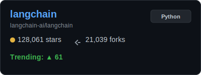
    </td>
    <td width="40%" style="vertical-align: top; text-align: center;">
      
    </td>
  </tr>
</table>

<a href="#table-of-contents">🔼 Back to Top</a>

---

---

<h2 id="how-to-contribute">🤝 Join the AI Hub Community</h2>

**GitTrendHub** is more than just a dashboard; it's a movement to track the AI revolution as it happens. We believe the best insights come from the community! 🚀

### Why Contribute?
- **Share the Pulse:** Help others discover the viral AI tools you've found on Reddit/X.
- **Build the Tooling:** Improve the dashboard's design and data engine for everyone.
- **Stay Ahead:** Be the first to document the next "game-changing" AI repository.

 

<table width="100%">
  <tr>
    <td width="50%" style="vertical-align: top;">
      <h4>🔥 Recommend a Viral Repo</h4>
      
Found something blowing up? Add it to the list!

      

      
<b>View Steps (Simple PR)</b>

       
      1. Open <code>GitTrendHub/projects.json</code>. 
      2. Choose a sub-category. 
      3. Add the repo: <code>{ "url_path": "OWNER/REPO", "last_stars": "Hot" }</code>. 
      4. Submit a PR titled <code>Recommend: OWNER/REPO</code>.
      

    </td>
    <td width="50%" style="vertical-align: top;">
      <h4>🛠️ Improve the Platform</h4>
      
Love Python or Design? Help us code the future.

      

      
<b>View Steps (Dev Focus)</b>

       
      1. Fork & Clone this repo. 
      2. Tweak <code>update_readme.py</code> or styles. 
      3. Run <code>python3 GitTrendHub/update_readme.py</code> to test. 
      4. Submit your Pull Request!
      

    </td>
  </tr>
</table>

 

---

### ❤️ Show Your Support
If you find this tracker useful, please **Give us a Star ⭐** and share it with your AI circles! The more people join, the better our "Trend of Trends" becomes.

 

---

## 📝 Data Summary

Data is retrieved using the GitHub REST API and GitHub Actions.

  <i>✨ Last Generated: March 03, 2026 - 16:16 UTC</i>

