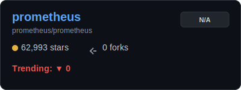
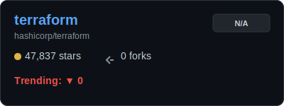
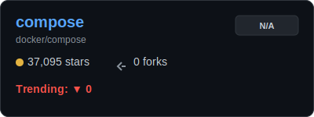
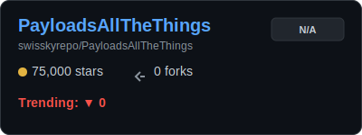
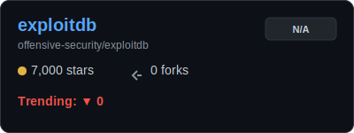
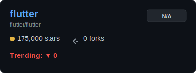
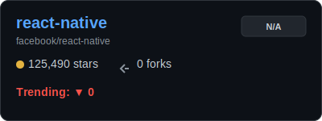
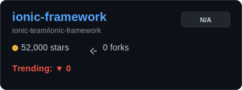

# 📈 GitTrendHub – The Pulse of Open Source

<div align="center">
  
</div>

<div align="center">
  
  
  <a href="https://github.com/YOUR_USERNAME/GitTrendHub/actions">
    
  </a>
</div>

<br />

## 📑 Table of Contents

- [🔥 Hot Trends](#hot-trends)
- [🤖 AI & Machine Learning](#ai)
- [🌐 Modern Web Development](#web)
- [⚡️ Productivity & Tools](#productivity)
- [♾️ DevOps & Cloud Native](#devops)
- [🛡️ Cybersecurity & Pentesting](#security)
- [📱 Mobile Development](#mobile)
- [🗄️ Databases & Infrastructure](#databases)
- [🤝 How to Contribute](#how-to-contribute)
- [📝 Data Summary](#-data--contributions)

<br />


<h2 id="hot-trends">🔥 Trend of Trends: Hot Movers</h2>
<div align="center">
  
  <p><i>The comparison above shows the real-time velocity of the fastest-growing projects in our curated collection.</i></p>
</div>
<br/>

<h2 id='ai'>🤖 AI & Machine Learning</h2>


<table width="100%">
  <tr>
    <td width="60%" style="vertical-align: top;">
      <h3><a href="https://github.com/Significant-Gravitas/AutoGPT">AutoGPT</a> <sub>(Vault Mode)</sub></h3>
      <p>Description not available</p>
      
    </td>
    <td width="40%" style="vertical-align: top; text-align: center;">
      <a href="https://star-history.com/#Significant-Gravitas/AutoGPT&Date">
        
      </a>
    </td>
  </tr>
</table>
<p align="right"><a href="#table-of-contents">🔼 Back to Top</a></p>


<table width="100%">
  <tr>
    <td width="60%" style="vertical-align: top;">
      <h3><a href="https://github.com/ollama/ollama">ollama</a> <sub>(Vault Mode)</sub></h3>
      <p>Description not available</p>
      
    </td>
    <td width="40%" style="vertical-align: top; text-align: center;">
      <a href="https://star-history.com/#ollama/ollama&Date">
        
      </a>
    </td>
  </tr>
</table>
<p align="right"><a href="#table-of-contents">🔼 Back to Top</a></p>


<table width="100%">
  <tr>
    <td width="60%" style="vertical-align: top;">
      <h3><a href="https://github.com/AUTOMATIC1111/stable-diffusion-webui">stable-diffusion-webui</a> <sub>(Vault Mode)</sub></h3>
      <p>Description not available</p>
      
    </td>
    <td width="40%" style="vertical-align: top; text-align: center;">
      <a href="https://star-history.com/#AUTOMATIC1111/stable-diffusion-webui&Date">
        
      </a>
    </td>
  </tr>
</table>
<p align="right"><a href="#table-of-contents">🔼 Back to Top</a></p>


<table width="100%">
  <tr>
    <td width="60%" style="vertical-align: top;">
      <h3><a href="https://github.com/huggingface/transformers">transformers</a> <sub>(Vault Mode)</sub></h3>
      <p>Description not available</p>
      
    </td>
    <td width="40%" style="vertical-align: top; text-align: center;">
      <a href="https://star-history.com/#huggingface/transformers&Date">
        
      </a>
    </td>
  </tr>
</table>
<p align="right"><a href="#table-of-contents">🔼 Back to Top</a></p>


<table width="100%">
  <tr>
    <td width="60%" style="vertical-align: top;">
      <h3><a href="https://github.com/langchain-ai/langchain">langchain</a> <sub>(Vault Mode)</sub></h3>
      <p>Description not available</p>
      
    </td>
    <td width="40%" style="vertical-align: top; text-align: center;">
      <a href="https://star-history.com/#langchain-ai/langchain&Date">
        
      </a>
    </td>
  </tr>
</table>
<p align="right"><a href="#table-of-contents">🔼 Back to Top</a></p>


<table width="100%">
  <tr>
    <td width="60%" style="vertical-align: top;">
      <h3><a href="https://github.com/open-webui/open-webui">open-webui</a> <sub>(Vault Mode)</sub></h3>
      <p>Description not available</p>
      
    </td>
    <td width="40%" style="vertical-align: top; text-align: center;">
      <a href="https://star-history.com/#open-webui/open-webui&Date">
        
      </a>
    </td>
  </tr>
</table>
<p align="right"><a href="#table-of-contents">🔼 Back to Top</a></p>


<table width="100%">
  <tr>
    <td width="60%" style="vertical-align: top;">
      <h3><a href="https://github.com/ggerganov/llama.cpp">llama.cpp</a> <sub>(Vault Mode)</sub></h3>
      <p>Description not available</p>
      
    </td>
    <td width="40%" style="vertical-align: top; text-align: center;">
      <a href="https://star-history.com/#ggerganov/llama.cpp&Date">
        
      </a>
    </td>
  </tr>
</table>
<p align="right"><a href="#table-of-contents">🔼 Back to Top</a></p>


---

<h2 id='web'>🌐 Modern Web Development</h2>


<table width="100%">
  <tr>
    <td width="60%" style="vertical-align: top;">
      <h3><a href="https://github.com/facebook/react">react</a> <sub>(Vault Mode)</sub></h3>
      <p>Description not available</p>
      
    </td>
    <td width="40%" style="vertical-align: top; text-align: center;">
      <a href="https://star-history.com/#facebook/react&Date">
        
      </a>
    </td>
  </tr>
</table>
<p align="right"><a href="#table-of-contents">🔼 Back to Top</a></p>


<table width="100%">
  <tr>
    <td width="60%" style="vertical-align: top;">
      <h3><a href="https://github.com/vercel/next.js">next.js</a> <sub>(Vault Mode)</sub></h3>
      <p>Description not available</p>
      
    </td>
    <td width="40%" style="vertical-align: top; text-align: center;">
      <a href="https://star-history.com/#vercel/next.js&Date">
        
      </a>
    </td>
  </tr>
</table>
<p align="right"><a href="#table-of-contents">🔼 Back to Top</a></p>


<table width="100%">
  <tr>
    <td width="60%" style="vertical-align: top;">
      <h3><a href="https://github.com/tailwindlabs/tailwindcss">tailwindcss</a> <sub>(Vault Mode)</sub></h3>
      <p>Description not available</p>
      
    </td>
    <td width="40%" style="vertical-align: top; text-align: center;">
      <a href="https://star-history.com/#tailwindlabs/tailwindcss&Date">
        
      </a>
    </td>
  </tr>
</table>
<p align="right"><a href="#table-of-contents">🔼 Back to Top</a></p>


<table width="100%">
  <tr>
    <td width="60%" style="vertical-align: top;">
      <h3><a href="https://github.com/sveltejs/svelte">svelte</a> <sub>(Vault Mode)</sub></h3>
      <p>Description not available</p>
      
    </td>
    <td width="40%" style="vertical-align: top; text-align: center;">
      <a href="https://star-history.com/#sveltejs/svelte&Date">
        
      </a>
    </td>
  </tr>
</table>
<p align="right"><a href="#table-of-contents">🔼 Back to Top</a></p>


<table width="100%">
  <tr>
    <td width="60%" style="vertical-align: top;">
      <h3><a href="https://github.com/vitejs/vite">vite</a> <sub>(Vault Mode)</sub></h3>
      <p>Description not available</p>
      
    </td>
    <td width="40%" style="vertical-align: top; text-align: center;">
      <a href="https://star-history.com/#vitejs/vite&Date">
        
      </a>
    </td>
  </tr>
</table>
<p align="right"><a href="#table-of-contents">🔼 Back to Top</a></p>


<table width="100%">
  <tr>
    <td width="60%" style="vertical-align: top;">
      <h3><a href="https://github.com/vuejs/core">core</a> <sub>(Vault Mode)</sub></h3>
      <p>Description not available</p>
      
    </td>
    <td width="40%" style="vertical-align: top; text-align: center;">
      <a href="https://star-history.com/#vuejs/core&Date">
        
      </a>
    </td>
  </tr>
</table>
<p align="right"><a href="#table-of-contents">🔼 Back to Top</a></p>


<table width="100%">
  <tr>
    <td width="60%" style="vertical-align: top;">
      <h3><a href="https://github.com/remix-run/remix">remix</a> <sub>(Vault Mode)</sub></h3>
      <p>Description not available</p>
      
    </td>
    <td width="40%" style="vertical-align: top; text-align: center;">
      <a href="https://star-history.com/#remix-run/remix&Date">
        
      </a>
    </td>
  </tr>
</table>
<p align="right"><a href="#table-of-contents">🔼 Back to Top</a></p>


---

<h2 id='productivity'>⚡️ Productivity & Tools</h2>


<table width="100%">
  <tr>
    <td width="60%" style="vertical-align: top;">
      <h3><a href="https://github.com/ohmyzsh/ohmyzsh">ohmyzsh</a> <sub>(Vault Mode)</sub></h3>
      <p>Description not available</p>
      
    </td>
    <td width="40%" style="vertical-align: top; text-align: center;">
      <a href="https://star-history.com/#ohmyzsh/ohmyzsh&Date">
        
      </a>
    </td>
  </tr>
</table>
<p align="right"><a href="#table-of-contents">🔼 Back to Top</a></p>


<table width="100%">
  <tr>
    <td width="60%" style="vertical-align: top;">
      <h3><a href="https://github.com/neovim/neovim">neovim</a> <sub>(Vault Mode)</sub></h3>
      <p>Description not available</p>
      
    </td>
    <td width="40%" style="vertical-align: top; text-align: center;">
      <a href="https://star-history.com/#neovim/neovim&Date">
        
      </a>
    </td>
  </tr>
</table>
<p align="right"><a href="#table-of-contents">🔼 Back to Top</a></p>


<table width="100%">
  <tr>
    <td width="60%" style="vertical-align: top;">
      <h3><a href="https://github.com/jesseduffield/lazygit">lazygit</a> <sub>(Vault Mode)</sub></h3>
      <p>Description not available</p>
      
    </td>
    <td width="40%" style="vertical-align: top; text-align: center;">
      <a href="https://star-history.com/#jesseduffield/lazygit&Date">
        
      </a>
    </td>
  </tr>
</table>
<p align="right"><a href="#table-of-contents">🔼 Back to Top</a></p>


<table width="100%">
  <tr>
    <td width="60%" style="vertical-align: top;">
      <h3><a href="https://github.com/alacritty/alacritty">alacritty</a> <sub>(Vault Mode)</sub></h3>
      <p>Description not available</p>
      
    </td>
    <td width="40%" style="vertical-align: top; text-align: center;">
      <a href="https://star-history.com/#alacritty/alacritty&Date">
        
      </a>
    </td>
  </tr>
</table>
<p align="right"><a href="#table-of-contents">🔼 Back to Top</a></p>


<table width="100%">
  <tr>
    <td width="60%" style="vertical-align: top;">
      <h3><a href="https://github.com/tmux/tmux">tmux</a> <sub>(Vault Mode)</sub></h3>
      <p>Description not available</p>
      
    </td>
    <td width="40%" style="vertical-align: top; text-align: center;">
      <a href="https://star-history.com/#tmux/tmux&Date">
        
      </a>
    </td>
  </tr>
</table>
<p align="right"><a href="#table-of-contents">🔼 Back to Top</a></p>


<table width="100%">
  <tr>
    <td width="60%" style="vertical-align: top;">
      <h3><a href="https://github.com/obsidianmd/obsidian-releases">obsidian-releases</a> <sub>(Vault Mode)</sub></h3>
      <p>Description not available</p>
      
    </td>
    <td width="40%" style="vertical-align: top; text-align: center;">
      <a href="https://star-history.com/#obsidianmd/obsidian-releases&Date">
        
      </a>
    </td>
  </tr>
</table>
<p align="right"><a href="#table-of-contents">🔼 Back to Top</a></p>


<table width="100%">
  <tr>
    <td width="60%" style="vertical-align: top;">
      <h3><a href="https://github.com/raycast/script-commands">script-commands</a> <sub>(Vault Mode)</sub></h3>
      <p>Description not available</p>
      
    </td>
    <td width="40%" style="vertical-align: top; text-align: center;">
      <a href="https://star-history.com/#raycast/script-commands&Date">
        
      </a>
    </td>
  </tr>
</table>
<p align="right"><a href="#table-of-contents">🔼 Back to Top</a></p>


---

<h2 id='devops'>♾️ DevOps & Cloud Native</h2>


<table width="100%">
  <tr>
    <td width="60%" style="vertical-align: top;">
      <h3><a href="https://github.com/kubernetes/kubernetes">kubernetes</a> <sub>(Vault Mode)</sub></h3>
      <p>Description not available</p>
      
    </td>
    <td width="40%" style="vertical-align: top; text-align: center;">
      <a href="https://star-history.com/#kubernetes/kubernetes&Date">
        
      </a>
    </td>
  </tr>
</table>
<p align="right"><a href="#table-of-contents">🔼 Back to Top</a></p>


<table width="100%">
  <tr>
    <td width="60%" style="vertical-align: top;">
      <h3><a href="https://github.com/prometheus/prometheus">prometheus</a> <sub>(Vault Mode)</sub></h3>
      <p>Description not available</p>
      
    </td>
    <td width="40%" style="vertical-align: top; text-align: center;">
      <a href="https://star-history.com/#prometheus/prometheus&Date">
        
      </a>
    </td>
  </tr>
</table>
<p align="right"><a href="#table-of-contents">🔼 Back to Top</a></p>


<table width="100%">
  <tr>
    <td width="60%" style="vertical-align: top;">
      <h3><a href="https://github.com/hashicorp/terraform">terraform</a> <sub>(Vault Mode)</sub></h3>
      <p>Description not available</p>
      
    </td>
    <td width="40%" style="vertical-align: top; text-align: center;">
      <a href="https://star-history.com/#hashicorp/terraform&Date">
        
      </a>
    </td>
  </tr>
</table>
<p align="right"><a href="#table-of-contents">🔼 Back to Top</a></p>


<table width="100%">
  <tr>
    <td width="60%" style="vertical-align: top;">
      <h3><a href="https://github.com/docker/compose">compose</a> <sub>(Vault Mode)</sub></h3>
      <p>Description not available</p>
      
    </td>
    <td width="40%" style="vertical-align: top; text-align: center;">
      <a href="https://star-history.com/#docker/compose&Date">
        
      </a>
    </td>
  </tr>
</table>
<p align="right"><a href="#table-of-contents">🔼 Back to Top</a></p>


---

<h2 id='security'>🛡️ Cybersecurity & Pentesting</h2>


<table width="100%">
  <tr>
    <td width="60%" style="vertical-align: top;">
      <h3><a href="https://github.com/swisskyrepo/PayloadsAllTheThings">PayloadsAllTheThings</a> <sub>(Vault Mode)</sub></h3>
      <p>Description not available</p>
      
    </td>
    <td width="40%" style="vertical-align: top; text-align: center;">
      <a href="https://star-history.com/#swisskyrepo/PayloadsAllTheThings&Date">
        
      </a>
    </td>
  </tr>
</table>
<p align="right"><a href="#table-of-contents">🔼 Back to Top</a></p>


<table width="100%">
  <tr>
    <td width="60%" style="vertical-align: top;">
      <h3><a href="https://github.com/sqlmapproject/sqlmap">sqlmap</a> <sub>(Vault Mode)</sub></h3>
      <p>Description not available</p>
      
    </td>
    <td width="40%" style="vertical-align: top; text-align: center;">
      <a href="https://star-history.com/#sqlmapproject/sqlmap&Date">
        
      </a>
    </td>
  </tr>
</table>
<p align="right"><a href="#table-of-contents">🔼 Back to Top</a></p>


<table width="100%">
  <tr>
    <td width="60%" style="vertical-align: top;">
      <h3><a href="https://github.com/offensive-security/exploitdb">exploitdb</a> <sub>(Vault Mode)</sub></h3>
      <p>Description not available</p>
      
    </td>
    <td width="40%" style="vertical-align: top; text-align: center;">
      <a href="https://star-history.com/#offensive-security/exploitdb&Date">
        
      </a>
    </td>
  </tr>
</table>
<p align="right"><a href="#table-of-contents">🔼 Back to Top</a></p>


---

<h2 id='mobile'>📱 Mobile Development</h2>


<table width="100%">
  <tr>
    <td width="60%" style="vertical-align: top;">
      <h3><a href="https://github.com/flutter/flutter">flutter</a> <sub>(Vault Mode)</sub></h3>
      <p>Description not available</p>
      
    </td>
    <td width="40%" style="vertical-align: top; text-align: center;">
      <a href="https://star-history.com/#flutter/flutter&Date">
        
      </a>
    </td>
  </tr>
</table>
<p align="right"><a href="#table-of-contents">🔼 Back to Top</a></p>


<table width="100%">
  <tr>
    <td width="60%" style="vertical-align: top;">
      <h3><a href="https://github.com/facebook/react-native">react-native</a> <sub>(Vault Mode)</sub></h3>
      <p>Description not available</p>
      
    </td>
    <td width="40%" style="vertical-align: top; text-align: center;">
      <a href="https://star-history.com/#facebook/react-native&Date">
        
      </a>
    </td>
  </tr>
</table>
<p align="right"><a href="#table-of-contents">🔼 Back to Top</a></p>


<table width="100%">
  <tr>
    <td width="60%" style="vertical-align: top;">
      <h3><a href="https://github.com/ionic-team/ionic-framework">ionic-framework</a> <sub>(Vault Mode)</sub></h3>
      <p>Description not available</p>
      
    </td>
    <td width="40%" style="vertical-align: top; text-align: center;">
      <a href="https://star-history.com/#ionic-team/ionic-framework&Date">
        
      </a>
    </td>
  </tr>
</table>
<p align="right"><a href="#table-of-contents">🔼 Back to Top</a></p>


---

<h2 id='databases'>🗄️ Databases & Infrastructure</h2>


<table width="100%">
  <tr>
    <td width="60%" style="vertical-align: top;">
      <h3><a href="https://github.com/supabase/supabase">supabase</a> <sub>(Vault Mode)</sub></h3>
      <p>Description not available</p>
      
    </td>
    <td width="40%" style="vertical-align: top; text-align: center;">
      <a href="https://star-history.com/#supabase/supabase&Date">
        
      </a>
    </td>
  </tr>
</table>
<p align="right"><a href="#table-of-contents">🔼 Back to Top</a></p>


<table width="100%">
  <tr>
    <td width="60%" style="vertical-align: top;">
      <h3><a href="https://github.com/redis/redis">redis</a> <sub>(Vault Mode)</sub></h3>
      <p>Description not available</p>
      
    </td>
    <td width="40%" style="vertical-align: top; text-align: center;">
      <a href="https://star-history.com/#redis/redis&Date">
        
      </a>
    </td>
  </tr>
</table>
<p align="right"><a href="#table-of-contents">🔼 Back to Top</a></p>


<table width="100%">
  <tr>
    <td width="60%" style="vertical-align: top;">
      <h3><a href="https://github.com/postgres/postgres">postgres</a> <sub>(Vault Mode)</sub></h3>
      <p>Description not available</p>
      
    </td>
    <td width="40%" style="vertical-align: top; text-align: center;">
      <a href="https://star-history.com/#postgres/postgres&Date">
        
      </a>
    </td>
  </tr>
</table>
<p align="right"><a href="#table-of-contents">🔼 Back to Top</a></p>


---


---

<h2 id="how-to-contribute">🤝 Join the Community & Contribute</h2>

We are looking for passionate contributors to help keep this dashboard the #1 resource for GitHub trends! 🚀

<details>
<summary><b>🔥 How to Recommend a Trending Repo? (Click to Expand)</b></summary>
<br>

If you've found a repository that is blowing up or is a hidden gem, we want to know!
1. **Open `GitTrendHub/projects.json`**.
2. Find the relevant category (or suggest a new one).
3. Add the repository in this format:
   ```json
   { "url_path": "OWNER/REPO", "last_stars": 0 }
   ```
4. Submit a **Pull Request** titled `Recommend: OWNER/REPO`.
</details>

<details>
<summary><b>🛠️ How to Contribute to the Tooling? (Click to Expand)</b></summary>
<br>

Want to improve our custom SVG generator or README layouts?
1. **Fork** this repository.
2. Clone it locally: `git clone https://github.com/YOUR_USERNAME/GitTrendHub.git`
3. Modify `GitTrendHub/update_readme.py` or the template.
4. Run locally to verify: `python3 GitTrendHub/update_readme.py`
5. Submit a **Pull Request** explaining your enhancements!
</details>

<details>
<summary><b>📊 Guideline for "Trending" Status</b></summary>
<br>

To maintain high quality, we generally look for repos that:
- Have gained significant stars recently.
- Are actively maintained (recent commits).
- Provide clear value to the developer community.
</details>

<br />

---

## 📝 Data Summary

Data is retrieved using the GitHub REST API and GitHub Actions. Historical data charts are seamlessly generated via [Star-History](https://star-history.com/).

<div align="right">
  <i>✨ Last Generated: March 03, 2026 - 15:36 UTC</i>
</div>
